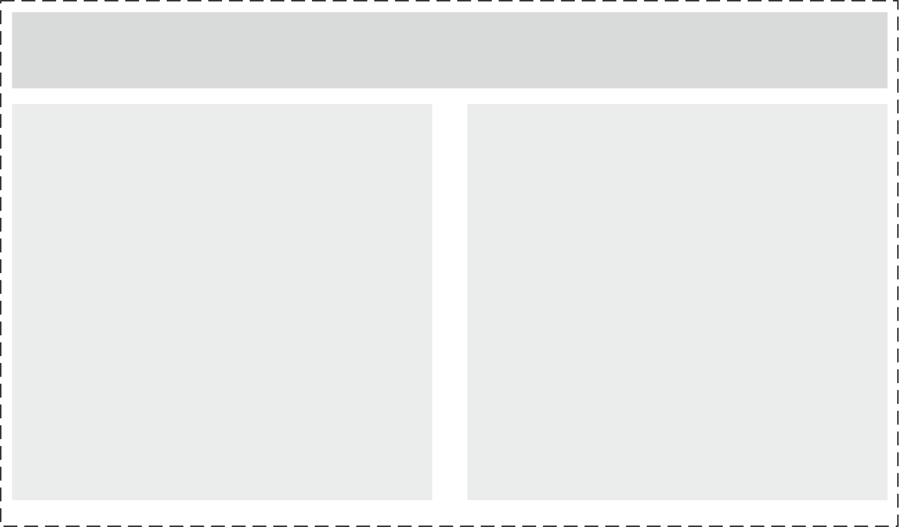
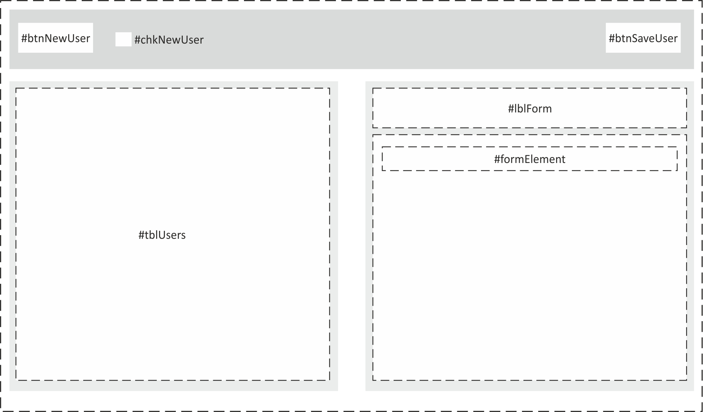

# User Interface Specification

| Project Name |  User Management Screen |
| ----------- | ----------- |
| Version | 1.0 |
| Created Date | 8/10/2021 |
| Created By |  Barış KARAMUSTAFA |
| Description | This document describes the user interface for the **User Management Screen** page. |

## **Table of Contents**
***

- [1. Page Layout](#pageLayout)
    - [1.1. Header Row](#headerRow)
    - [1.2. Content Row](#contentRow)
- [2. Elements](#pageElements)
    - [2.1. Header Elements](#headerElements)
        - [#btnNewUser](#btnNewUser)
        - [#chkNewUser](#chkNewUser)
        - [#btnSaveUser](#btnSaveUser)
    - [2.2. Content Elements](#contentElements)
        - [#tblUsers](#tblUsers)
        - [#formUser](#formUser)
        - [#lblForm](#lblForm)
        - [#formElement](#formElement)

## **1. Page Layout**
***

<strong>Figure 1 :</strong> Page Layout

Page consists two rows. Rows fill the width and height of the screen. There are margins between columns and rows.

**1.1. Header Row** : This row consists **left aligned** button *[#btnNewUser](#btnNewUser)* and *[#chkNewUser](#chkNewUser)* and **right aligned** button *[#btnSaveUser](#btnSaveUser)*.

**1.2. Content Row** : This row consists two columns with same width. **Left column** has table *[#tblUsers](#tblUsers)* and **right column** has user form *[#formUser](#formUser)*.

## **2. Elements**
***

<strong>Figure 2 :</strong> Form Elements

## **2.1 Header Elements**

<h3 id="btnNewUser">#btnNewUser</h3> 

|   |   |   |
|---|---|---|
|⚙| **Type** | Button |
|⚙| **Label** | ➕ New User|
|⚙| **Enabled** | True |
|⚡| **onClick()** | <ul><li>After click this button, *[#formUser](#formUser)* will appear (*Show=true*) with empty form elements for new user register.</li><li>*[#btnSaveUser](#btnSaveUser)* will be active (*Enabled=true*).</li><li>*[#lblForm](#lblForm)*'s label will be "New User".</li></ul>  |

<h3 id="chkNewUser">#chkNewUser</h3> 

|   |   |   |
|---|---|---|
|⚙| **Type** | Checkbox |
|⚙| **Label** | Hide Disabled User |
|⚙| **Enabled** | True |
|⚙| **Default Value** | False |
|⚡| **onSelectionChanged()** | If checkbox is active, then hide disabled users (*enabled=false*) in *[#tblUsers](#tblUsers)*. Else show all user both *enabled=false* or *enabled=true* |

<h3 id="btnSaveUser">#btnSaveUser</h3> 

|   |   |   |
|---|---|---|
|⚙| **Type** | Button |
|⚙| **Label** | Save User |
|⚙| **Enabled** | False |
|⚡| **onClick()** | <ol><li>Validate *[#formUser](#formUser)* for required fields.</li><li>If form is not valid display alert and warn the user for required fields.</li><li>If form is valid create new user or update existing user.</li><li>Refresh *[#tblUsers](#tblUsers)* for updated data</li></ol>  |

## **2.2 Content Elements**

<h3 id="tblUsers">#tblUsers</h3> 

- This table shows users. Table loads with user info when the page inits.
- Table has four columns.
    - ID
    - Username
    - Email
    - Enabled
- Table fills width and height of its container. *[See Figure 2](#imgFigure2)*
- Table can only vertically scrollable but header row must be fixed position.
- Each column in the header row includes column text, filter and sort buttons.
- In default ID column sorted by ascending.
- When click the filter button in the header row a popup will be shown. Corresponding column can be filtered or existing filter can be cleared in this popup.
- Each table row must be clickable and selectable.
- When double-click to a row, *[#formUser](#formUser)* will be shown and fill with selected user details. *[#btnSaveUser](#btnSaveUser)* will be enabled. *[#lblForm](#lblForm)* text will be "Edit User".

**Columns**

| No  |  Field |  Title  | Sortable | Filterable | Style |
|---|---|---|---|---|---|
|1| ID | ID |✔| ✔ | <ul><li>**Header Text Align** : Left</li><li>**Item Text Align** : Right</li></ul> |
|2| Username | User Name |✔| ✔ | <ul><li>**Header Text Align** : Left</li><li>**Item Text Align** : Left</li></ul> |
|3| Email | Email |✔| ✔ | <ul><li>**Header Text Align** : Left</li><li>**Item Text Align** : Left</li></ul> |
|4| Enabled | Enabled |✔| ✔ | <ul><li>**Header Text Align** : Left</li><li>**Item Text Align** : Left</li></ul> |

<h3 id="formUser">#formUser</h3> 

- This form allows insert new user or update existing user.
- As default this form is hidden. Only visible when user create or update.
- Form has label and label text will be "New User" or "Edit User" according to process.
- Form has input elements (*[#formElement](#formElement)*).

| No  |  Field |  Type  | Label | Default Value | Required | Placeholder | Mask |
|---|---|---|---|---|---|---|---|
|1|Username|TextInput|Username||✔|||
|2|DisplayName|TextInput|Display Name||❌|||
|3|Phone|NumberInput|Phone||✔|||
|4|Email|TextInput|Email||❌|||
|5|UserRoles|SelectBox|User Roles||✔|Select user roles...||
|6|Enabled|CheckBox|Enabled|False|❌|||

> UserRoles select box can take one of the following values.
> - Guest
> - Admin
> - SuperAdmin

<h3 id="lblForm">#lblForm</h3> 

|   |   |   |
|---|---|---|
|⚙| **Type** | Label |
|⚙| **Label** |  |

<h3 id="formElement">#formElement</h3> 

|   |   |   |
|---|---|---|
|⚙| **Name** | - |
|⚙| **Type** | - |
|⚙| **Label** | - |
|⚙| **Default Value** | - |
|⚙| **Required** | - |
|⚙| **Placeholder** | - |
|⚙| **Mask** | - |
